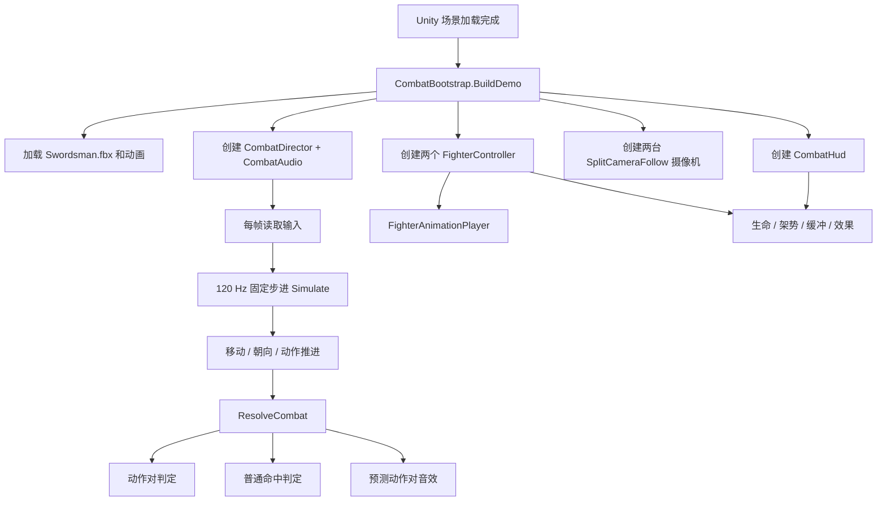

# Swordman2 开发与修改指南

> 文档基于 2026-07-14 的当前代码整理。本文中的“接口/入口”包括公开方法、资源路径、键位入口和常用配置参数，并非网络端口。本项目当前没有网络通信模块或监听端口。

## 1. 项目定位与运行环境

这是一个 Unity 双人本地键盘动作游戏原型

- 双人本地输入；
- 左右分屏、近距离越肩摄像机；
- 双方自动互相朝向；
- A/B/C 三种攻击；
- 输入缓冲、架势、生命、效果延时；
- 有效期重叠形成“动作对”；
- 普通命中延迟到有效期结束后确认；
- 动作对预测音效；
- 暂停、动态信息和运行时调试数值面板。

当前主要环境：

| 项目 | 当前值 |
|---|---|
| Unity | 6000.5.2f1 |
| 渲染管线 | URP 17.5.0 |
| 输入 | Input System 1.19.0 |
| UI | UGUI 2.5.0 + IMGUI 调试窗口 |
| 逻辑模拟频率 | 120 Hz |
| 动作原始帧率 | 30 FPS |
| Blender 源文件版本记录 | Blender 5.1.2 |

Unity 项目目录为 `Swordman2/`。场景中的战斗对象绝大部分由代码运行时生成，不依赖手工摆放的玩家 Prefab。

## 2. 目录和脚本职责

### 2.1 Unity 运行时脚本

目录：`Swordman2/Assets/Scripts/Combat/`

| 文件 | 主要职责 |
|---|---|
| `CombatBootstrap.cs` | 游戏启动入口；创建场地、玩家、战斗控制器、音效、摄像机和 HUD；加载 FBX 与动画。 |
| `CombatDefinitions.cs` | 攻击枚举、动作阶段、动作配置、动作运行时状态、动作对速度配置。 |
| `CombatDirector.cs` | 读取双人输入；执行 120 Hz 固定步进；判定普通命中、动作对、范围与预测音效。 |
| `FighterController.cs` | 单个玩家的生命、架势、移动、攻击、缓冲、效果、受击和动画状态。 |
| `FighterAnimationPlayer.cs` | 基于 Playables 播放动画、双槽混合、循环、速率自适应。 |
| `SplitCameraFollow.cs` | 越肩摄像机跟随、平滑移动、持续看向对手。 |
| `CombatAudio.cs` | 加载音频、动作对连段音效、预测播放、叠音音源池。 |
| `CombatHud.cs` | 血条/架势条/效果条、事件文字、暂停界面、动态说明、临时数值调节。 |

### 2.2 Unity 编辑器脚本

目录：`Swordman2/Assets/Editor/`

| 文件 | 主要职责 |
|---|---|
| `SwordsmanModelImporter.cs` | 仅处理 `Resources/Models/Swordsman.fbx`；配置 Generic 动画，设置 Idle/Walk 循环并保留原始位置/朝向。 |
| `CombatPlayModeVerifier.cs` | 自动进入 Play Mode，依次验证摄像机、HUD、动画、动作对、缓冲、效果和普通命中，并可输出预览图。 |

### 2.3 Blender 与动作数据脚本

目录：`New Folder/`

| 文件 | 主要职责 |
|---|---|
| `generate_lowpoly_swordsman.py` | 清空 Blender 场景并生成低多边形剑士、29 根骨骼、12 个动作、预览图和验证报告。 |
| `export_all_action_frames.py` | 从 `2.blend` 逐帧导出全部骨骼矩阵与关键标记点，生成 JSON/CSV。 |
| `2.blend` | 当前 Blender 模型与动画源文件。 |
| `2.fbx` | Blender 导出的 FBX 中间文件。生成脚本本身不会自动导出 FBX。 |
| `2_validation.json` | 骨骼、动作、网格的生成验证结果。 |
| `all_action_frames.json` | 12 个动作的完整逐帧骨骼数据，约 41 MB；Unity 运行时不读取。 |
| `all_action_frame_summary.csv` | 逐帧关键点摘要；Unity 运行时不读取。 |

`Assets/TutorialInfo/` 下的 `Readme.cs` 和 `ReadmeEditor.cs` 是 Unity 模板说明脚本，不参与战斗。

## 3. 总体运行结构



### 3.1 启动顺序

`CombatBootstrap.BuildDemo()` 使用 `RuntimeInitializeOnLoadMethod(AfterSceneLoad)` 自动执行：

1. 如果场景已经存在 `CombatDirector`，立即退出，避免重复创建。
2. 设置目标帧率 120，并关闭 VSync。
3. 删除场景中已有 Camera。
4. 运行时创建地面、网格线和方向光。
5. 从 `Resources/Models/Swordsman` 加载模型和所有动画片段。
6. 创建 P1/P2，对应初始位置 `(-1.45,0,0)` 与 `(1.45,0,0)`。
7. 创建 `CombatAudio`、`CombatDirector` 并注入两个玩家。
8. 创建左右各占屏幕一半的摄像机。
9. 创建 HUD。

因此，如果要把本项目改为正式关卡/Prefab 工作流，需要先决定是否保留该运行时 Bootstrap；否则手工放置的 Camera 会被删除。

## 4. 输入和操作

### 4.1 双人战斗输入

| 功能 | P1 | P2 |
|---|---|---|
| 前后左右移动 | W / S / A / D | ↑ / ↓ / ← / → |
| A 轻击 | F | `,` |
| B 重击 | G | `.` |
| C 挑飞 | H | `/` |

移动是锁定对手后的局部方向：前表示朝向对手，后表示远离，左右表示横向移动。

### 4.2 系统与调试输入

| 键 | 功能 |
|---|---|
| P | 暂停/继续；暂停时 `Time.timeScale=0`，战斗、动画、缓冲和音频停止。 |
| U | 显示/隐藏动态战斗信息；内容直接读取当前代码配置和实时玩家状态。 |
| I | 将双方生命与架势恢复到正常上限 5，并恢复 HUD 的正常 0～5 刻度。 |
| O | 显示/隐藏临时调节窗口；鼠标调整双方生命和架势，临时范围为 0～50。 |

`CombatDirector` 在 `Time.timeScale <= 0` 时不读取战斗输入；`CombatHud` 仍会读取 P/U/I/O，因此暂停菜单可以操作。

## 5. 战斗时序和状态

### 5.1 状态枚举

`FighterMode`：

- `Free`：可移动、可立即出招、恢复架势、效果条倒计时。
- `Attack`：执行攻击，不可移动。
- `Rebound`：动作对后的弹回锁定。
- `Hit`：普通命中后的受击锁定。

`AttackPhase`：

- `Windup`：前摇。
- `Active`：有效期。
- `Recovery`：后摇。
- `Finished`：动作结束。

### 5.2 固定步进

`CombatDirector` 每个 Unity `Update` 累积 `Time.deltaTime`，再以 `1/120` 秒步进执行：

1. 写入移动输入；
2. 更新双方朝向；
3. 移动；
4. 再次更新朝向；
5. 推进双方动作；
6. 统一结算战斗。

累积时间最多保留 0.1 秒，防止卡顿后一次补算过多。

### 5.3 当前动作时间配置

位置：`CombatDefinitions.cs -> AttackDefinition.New()`。

当前 A/B/C 共用：

| 参数 | 当前值 | 说明 |
|---|---:|---|
| `FramesPerSecond` | 30 | 动作配置帧率。 |
| `GlobalActionSpeed` | 3.5 | 全局动作加速倍率。 |
| `TotalFrames` | 52 | 总动作帧数。 |
| `ActiveStartFrame` | 12 | 有效期开始帧。 |
| `ActiveEndFrame` | 32 | 有效期结束帧。 |
| `ReboundEntryFrame` | 21 | 弹回动画的归一化起播参考帧。 |
| `BlendSeconds` | 0.08 | 动画混合时间。 |
| `Radius` | 2.1 m | 攻击范围。 |

无效果时的实际时间：

```text
总时长 = TotalFrames / 30 / GlobalActionSpeed
有效期开始 = ActiveStartFrame / 30 / GlobalActionSpeed
有效期结束 = ActiveEndFrame / 30 / GlobalActionSpeed
```

按当前值：总时长约 0.495 秒，有效期约从 0.114 秒到 0.305 秒，连续时间长度约 0.190 秒。

注意：A/B/C 当前共用 `New()` 内的帧配置。直接修改会同时影响三种攻击。要单独配置，需要给 `New()` 增加各动作的帧参数或改为独立配置对象。

### 5.4 当前攻击基础数据

位置：`CombatDefinitions.cs -> AttackDefinition.Create()`。

| 攻击 | 名称 | 架势消耗 | 普通伤害 | 成功动画 |
|---|---|---:|---:|---|
| A | 轻击 | 1 | 1 | 左右斩成功动画交替 |
| B | 重击 | 2 | 3 | 横扫成功动画 |
| C | 挑飞 | 1 | 1 | 左右斩成功动画交替；目前没有真正挑飞位移 |

## 6. 普通命中与动作对规则

### 6.1 范围判定

`FighterController.IsInRangeOf()` 同时要求：

- 水平距离不超过攻击 `Radius`；
- 攻击者面对目标，点积不小于 0。

玩家持续自动朝向对手，所以通常距离是主要条件。

### 6.2 动作对成立条件

动作对必须同时满足：

1. 两方都存在当前攻击；
2. 两方当前都处于 `Active`；
3. 两方分别都在对方攻击范围内；
4. 两个攻击都尚未 `Settled`。

动作对一旦结算会标记动作已处理，避免每个固定步重复结算。

### 6.3 动作对结果矩阵

| 组合 | 结果 |
|---|---|
| A + A | 双方弹回，不扣血。 |
| A + B | 双方弹回，不扣血。 |
| A + C | 双方弹回；A 方获得 0.3 秒效果。 |
| B + B | 双方弹回，不扣血。 |
| B + C | B 方继续成功横扫；C 方弹回、损失 3 血并获得 0.3 秒效果。 |
| C + C | 双方弹回，不扣血。 |

重要配置：

- `CombatDirector.BCPairDamage = 3`
- `CombatDirector.PairEffectDuration = 0.3f`

### 6.4 普通命中规则

普通命中不会在有效期刚碰到目标时立即发生，而是在攻击有效期结束后统一确认：

1. 攻击的有效期已经结束；
2. 整个有效期内和对方有效期没有任何时间重叠；
3. 有效期内至少有一个固定步目标在攻击范围内。

满足后才调用目标的 `ReceiveNormalHit()`。

只要双方有效期曾经重叠，即使当时距离不足以形成动作对，也不会再结算普通命中。该行为由 `HadTemporalOverlap` 保证。

## 7. 动作对成立后的独立速度

位置：`CombatDefinitions.cs -> PairActionSpeed`。

这些倍率只控制动作对成立后的剩余动画和锁定时间；成立前仍由 `GlobalActionSpeed` 控制。数值大于 1 加快，小于 1 减慢。

| 参数 | 当前值 | 对应方 |
|---|---:|---|
| `AA` | 0.48 | A+A 双方 |
| `AB_A` | 0.40 | A+B 中 A 方 |
| `AB_B` | 0.30 | A+B 中 B 方 |
| `AC_A` | 0.45 | A+C 中 A 方 |
| `AC_C` | 0.50 | A+C 中 C 方 |
| `BB` | 0.30 | B+B 双方 |
| `BC_B` | 0.35 | B+C 中 B 方 |
| `BC_C` | 0.40 | B+C 中 C 方 |
| `CC` | 0.60 | C+C 双方 |

弹回方通过 `EnterRebound(multiplier)` 同步改变动画速度与锁定时长。B+C 中 B 方不弹回，而是通过 `ApplyPairContinuationSpeed()` 同步加速或减速当前成功动画和逻辑时间。

## 8. 架势、输入缓冲和效果延时

### 8.1 架势

位置：`FighterController.cs`。

- 正常上限：5；
- 自由状态持续 0.3 秒后开始恢复；
- 恢复速度：`5 / 1.5`，即约 3.333/秒；
- 攻击、弹回和受击期间不恢复；
- 架势不足时攻击不能立即开始，会进入输入缓冲。

### 8.2 输入缓冲

- 只保留最新攻击输入；
- 有效期 `InputBufferLifetime = 0.4f`；
- 新攻击会替换旧攻击并重新计时；
- 缓冲计时在攻击、弹回和受击期间继续；
- 0.4 秒内角色恢复可行动且架势足够，则执行缓冲；
- 超时会清除，不能一直等架势恢复后自动出招。

### 8.3 效果延时

动作对效果由 `EffectTime` 保存。效果在攻击/弹回/受击期间冻结，只在 `Free` 状态倒计时。

下一次攻击开始时：

```text
延时后动作总时长 = 基础总时长 + 剩余效果时间 × EffectDelayStrength
```

当前：

- `PairEffectDuration = 0.3 秒`
- `EffectDelayStrength = 2`

如果完整效果立即作用于下一次攻击，则额外增加 0.6 秒。动画播放速度、动作总时长和有效期会一起按 `TimeScale` 延长，然后效果清零。

## 9. 动画系统

### 9.1 动画资源名称

运行时要求 FBX 中存在：

- `Idle_TwoHand_Sword`
- `Walk_Forward`
- `Walk_Backward`
- `Walk_Left`
- `Walk_Right`
- `Attack_RtoL_Success`
- `Attack_RtoL_Blocked`
- `Attack_LtoR_Success`
- `Attack_LtoR_Blocked`
- `Attack_Horizontal_Success`
- `Attack_Horizontal_Blocked`
- `Hit_Reaction_Front`

`CombatBootstrap.ValidateClips()` 会在缺失时输出错误。

### 9.2 播放方式

`FighterAnimationPlayer`：

- 清空 Animator Controller，使用 `PlayableGraph`；
- 两个 `AnimationClipPlayable` 槽位交替播放并混合；
- `PlaybackSpeedForDuration()` 用 FBX 片段真实长度除以逻辑目标时长，使动画自动适应动作配置；
- `MultiplyCurrentSpeed()` 用于 B+C 中 B 方动作对后的继续动画；
- Idle 和 Walk 循环，攻击/弹回/受击不循环；
- Walk 播放速度使用 `MoveSpeed / 0.68` 匹配位移速度；
- 模型视觉节点局部旋转 Y=180°，修正 Blender/Unity 前向差异；
- `Animator.applyRootMotion=false`，移动完全由 `CharacterController` 驱动。

### 9.3 修改动画时的注意事项

- 改 `TotalFrames` 会改变逻辑时长，动画会通过播放速度适应。
- 改 `ActiveStartFrame/ActiveEndFrame` 只改变逻辑有效期，不会自动修改 FBX 动作姿势；应确保有效帧对应剑真正经过目标的位置。
- 改 `ReboundEntryFrame` 会改变弹回片段的归一化起播位置。
- FBX 动作重命名后必须同步修改 `SuccessClip()`、`ReboundClip()`、Bootstrap 验证名单和导入/生成脚本。

## 10. 摄像机

### 10.1 创建参数

`CombatBootstrap.BuildCamera()`：

| 参数 | 当前值 |
|---|---:|
| 左右视口 | P1: 0～0.5；P2: 0.5～1 |
| FOV | 63 |
| Near Clip | 0.05 |
| Far Clip | 80 |
| AudioListener | 仅 P1 摄像机 |

### 10.2 跟随参数

`SplitCameraFollow.cs`：

| 参数 | 当前值 | 影响 |
|---|---:|---|
| `Distance` | 1.15 | 摄像机在玩家后方距离。 |
| `Height` | 2.2 | 摄像机高度。 |
| `ShoulderOffset` | 0.7 | 右肩横向偏移。 |
| `Smoothness` | 12 | 跟随与旋转平滑度。 |

摄像机始终以对手水平位置定义前向，观察点为对手位置上方 1.18 米。

## 11. 音效系统

### 11.1 资源路径

目录：`Swordman2/Assets/Resources/Audio/`

| 文件 | 用途 |
|---|---|
| `PerfectParry4.mp3` | 动作对连段第 1 个音效。 |
| `PerfectParry5.mp3` | 动作对连段第 2 个音效。 |
| `PerfectParry6.mp3` | 动作对连段第 3 个音效。 |
| `NormalHit.mp3` | 普通命中；源素材对应“完美弹反7”。 |

### 11.2 当前逻辑和参数

`CombatAudio.cs`：

| 参数 | 当前值 | 说明 |
|---|---:|---|
| `PairChainWindow` | 1.5 秒 | 两次动作对预测时间差不超过该值则继续连段。 |
| `PairPredictionLead` | 1 秒 | 最多提前多久播放动作对音效。 |
| `Perfect4StartOffset` | 0.3 秒 | 音效 4 从资源的 0.3 秒处开始播放。 |
| `SourcePoolSize` | 8 | 可并行使用的 AudioSource 数量。 |

连段序列为 `4 → 5 → 6 → 4 → ...`。超过 1.5 秒后重置到 4。

动作对音效预测会计算两个攻击的实际有效期（包括效果延时），并要求预测时刻存在时间重叠且双方在攻击范围内。攻击状态下玩家不能移动，因此双方动作都开始后，距离预测是确定的。每组攻击通过 `PairAudioPlayed` 保证只播一次；如果没能提前播放，动作对实际成立时补播。

普通命中音效只在普通命中正式结算时播放，不预测。

## 12. HUD、暂停和临时调试

`CombatHud` 在运行时创建整个 Canvas：

- 左右玩家面板；
- 生命、架势、效果三条进度条；
- 底部最近战斗事件；
- U 动态说明面板；
- P 暂停遮罩；
- O IMGUI 临时数值窗口。

正常生命/架势上限是 5。O 面板调用 `SetTemporaryVitals()` 后，该玩家使用 0～50 的临时显示刻度；生命和架势可以暂时超过正常上限。I 调用 `RestoreVitals()` 后数值回到 5，显示刻度也回到 0～5。

动态 U 面板不是固定说明文字，它会实时读取：

- 当前 A/B/C 伤害和架势消耗；
- 全局动作速度、总时长、有效期和范围；
- 动作对各方速度倍率；
- B+C 伤害、效果持续时间与延时强度；
- 音效提前量；
- 双方实时生命、架势、效果、状态和缓冲数量。

## 13. 重要公开接口

### 13.1 `CombatDirector`

| 接口 | 用途 |
|---|---|
| `Initialize(p1, p2, audio)` | 注入双方玩家与音效系统，建立对手引用。 |
| `PlayerOne / PlayerTwo` | HUD、测试和外部系统访问双方状态。 |
| `LastEvent` | HUD 显示最近一次战斗结果。 |

### 13.2 `FighterController`

| 接口 | 用途 |
|---|---|
| `SubmitAttack(kind)` | 提交攻击；可能立即执行或进入 0.4 秒缓冲。 |
| `SetMovementInput(input)` | 写入当前移动输入。 |
| `Advance(deltaTime)` | 推进动画、动作、缓冲、效果和架势恢复。 |
| `UpdateMovement(deltaTime)` | 仅自由状态移动。 |
| `UpdateFacing()` | 朝向对手。 |
| `IsInRangeOf(target, radius)` | 距离与朝向判定。 |
| `MarkAttackSettled()` | 标记当前攻击已经结算。 |
| `EnterRebound(speed)` | 进入弹回并同步动画/逻辑速度。 |
| `ReceiveNormalHit(damage)` | 扣血并进入受击状态。 |
| `ApplyPairDamage(damage)` | 动作对直接扣血，不进入普通受击动画。 |
| `ApplyPairContinuationSpeed(speed)` | 调节仍继续成功动作的一方。 |
| `ApplyEffect(seconds)` | 增加效果条。 |
| `RestoreVitals()` | 正常回满并退出临时 50 刻度。 |
| `SetTemporaryVitals(hp, stance)` | O 面板临时设置 0～50。 |
| `Teleport(position)` | 测试或关卡逻辑瞬移。 |
| `DebugState()` | HUD/测试使用的可读状态。 |

### 13.3 `CombatAudio`

| 接口 | 用途 |
|---|---|
| `Initialize()` | 从 Resources 加载 4 个音频并创建音源池。 |
| `PlayActionPair(predictedPairTime)` | 根据动作对时间推进 4/5/6 连段。 |
| `PlayNormalHit()` | 播放普通命中。 |
| `PairChainIndex` | 当前连段索引，0/1/2 对应 4/5/6。 |
| `LastPlayedClipName` | 最近播放的片段名，便于调试。 |

## 14. 常用修改入口速查

| 需求 | 修改位置 |
|---|---|
| 全局攻击速度 | `CombatDefinitions.cs -> GlobalActionSpeed` |
| A/B/C 架势消耗和普通伤害 | `CombatDefinitions.cs -> AttackDefinition.Create()` |
| 总帧、有效帧、弹回帧、范围 | `CombatDefinitions.cs -> AttackDefinition.New()` |
| 各动作对成立后速度 | `CombatDefinitions.cs -> PairActionSpeed` |
| B+C 动作对伤害 | `CombatDirector.cs -> BCPairDamage` |
| 效果条持续时间 | `CombatDirector.cs -> PairEffectDuration` |
| 效果对下一动作的延时强度 | `FighterController.cs -> EffectDelayStrength` |
| 正常生命/架势上限 | `FighterController.cs -> MaxHealth / MaxStance` |
| O 调试窗口临时上限 | `FighterController.cs -> TemporaryVitalLimit` |
| 架势恢复延迟/速度 | `FighterController.cs -> StanceRecoveryDelay / StanceRecoveryRate` |
| 输入缓冲寿命 | `FighterController.cs -> InputBufferLifetime` |
| 移动速度 | `FighterController.cs -> MoveSpeed` |
| 步行动画匹配基准 | `FighterController.PlayFreeAnimation() -> 0.68f` |
| 普通受击时长 | `FighterController.cs -> HitDuration` |
| 摄像机位置和平滑 | `SplitCameraFollow.cs` |
| 摄像机 FOV/裁剪面 | `CombatBootstrap.BuildCamera()` |
| 音效提前/连段/片头跳过 | `CombatAudio.cs` 顶部常量 |
| 音效音量 | `CombatAudio.Initialize() -> source.volume` |
| UI 尺寸、字体、颜色 | `CombatHud.cs` 各 Build 方法 |
| 双人键位 | `CombatDirector.ReadInput()` |
| P/U/I/O 功能键 | `CombatHud.Update()` |
| FBX 循环和导入设置 | `SwordsmanModelImporter.cs` |

## 15. 典型功能修改方法

### 15.1 给 A/B/C 设置不同有效帧

当前三者共用 `New()`。建议扩展为：

```csharp
New(kind, name, stance, damage, totalFrames, activeStart, activeEnd, reboundFrame)
```

然后在 `Create()` 的 A/B/C 分支分别传值。不要只修改动画资源而不修改逻辑帧。

### 15.2 增加新攻击 D

至少需要同步：

1. 给 `AttackKind` 增加 D；
2. 在 `AttackDefinition.Create()` 创建 D 配置；
3. 给 D 设置成功/弹回动画映射；
4. 在 `CombatDirector.ReadInput()` 增加键位；
5. 扩展动作对矩阵和结果逻辑；
6. 扩展 `PairActionSpeed`；
7. 在 Blender/FBX 中增加动画；
8. 扩展 `ValidateClips()`、导入规则、动态 U 信息和自动验证。

### 15.3 修改动作对规则

入口是 `CombatDirector.ResolveActionPair()`。建议保持当前模式：先计算双方结果，再统一修改双方状态，避免 P1/P2 调用顺序改变结果。

如果新增动作对伤害，优先把数值提取为公开常量或配置字段，再让 U 面板和测试引用同一个值，避免界面/测试写死旧数值。

### 15.4 修改音频文件

保持 `Resources/Audio` 下英文资源名，或同步修改 `CombatAudio.Initialize()` 中的 Resources 路径。Unity 加载 Resources 时路径不写扩展名。

### 15.5 改为 Inspector/ScriptableObject 配置

目前大量参数是 `const`，适合原型快速迭代，但每次修改都需要重新编译。正式化时建议优先迁移：

- `AttackDefinition` → 每种攻击一个 ScriptableObject；
- `PairActionSpeed` → 动作对矩阵配置；
- 摄像机/音频/UI 常量 → 可序列化配置组件；
- HUD 动态说明继续读取同一配置源。

## 16. 模型与动作资源工作流

### 16.1 重新生成 Blender 源文件

在带 `bpy` 的 Blender Python 环境运行：

```powershell
blender --background --python "New Folder/generate_lowpoly_swordsman.py"
```

会覆盖/生成：

- `New Folder/2.blend`
- `New Folder/2_preview.png`
- `New Folder/2_validation.json`

脚本会清空当前 Blender 场景，必须以后台新进程或确认无未保存内容的 Blender 文件运行。

### 16.2 导出逐帧数据

让 Blender 打开 `2.blend` 后执行：

```powershell
blender --background "New Folder/2.blend" --python "New Folder/export_all_action_frames.py"
```

生成完整 JSON 和 CSV。它们用于分析/验证，不被 Unity 运行时加载。

### 16.3 FBX 到 Unity

当前生成脚本不含 FBX 导出步骤。需要从 Blender 导出 FBX，再复制/覆盖：

```text
Swordman2/Assets/Resources/Models/Swordsman.fbx
```

Unity 会由 `SwordsmanModelImporter` 自动应用导入设置。覆盖后检查 Console 是否有缺少动画的错误。

## 17. 验证与调试

### 17.1 运行时人工检查

建议每次改战斗参数后至少验证：

1. A+A 是否双方弹回且不扣血；
2. B+C 是否 B 继续、C 弹回并扣当前配置伤害；
3. A+C 是否只给 A 效果；
4. 有效期不重叠时普通命中是否在有效期结束后发生；
5. 有效期曾重叠但距离不足时是否双方都不普通命中；
6. 架势不足的缓冲是否在 0.4 秒后删除；
7. 效果是否按 `EffectDelayStrength` 延长下一动作；
8. 动作对音效是否按 4/5/6 循环且不重复；
9. P/U/I/O 是否在暂停与运行状态都符合预期；
10. UI 数字与条形比例是否同步。

### 17.2 C# 编译检查

在 Unity 已生成 `.csproj` 后可执行：

```powershell
dotnet build Swordman2/Assembly-CSharp.csproj --no-restore
dotnet build Swordman2/Assembly-CSharp-Editor.csproj --no-restore
```

Unity 生成的项目可能产生 NUnit/目标框架版本警告；重点检查是否存在 C# 编译错误。

### 17.3 自动 Play Mode 验证

关闭正在占用项目的 Unity Editor 后，可以调用：

```powershell
& "C:\Program Files\Unity\Hub\Editor\6000.5.2f1\Editor\Unity.exe" `
  -batchmode `
  -projectPath "D:\0000\app_codex\swordman2\Swordman2" `
  -executeMethod CombatPlayModeVerifier.Run `
  -logFile "D:\0000\app_codex\swordman2\Swordman2\combat-verification.log"
```

验证脚本成功时输出 `VERIFY_PASS`，失败时输出 `VERIFY_FAIL`，并在有图形设备时生成 `combat-preview.png`。

